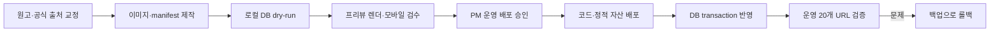

# 인파 블로그 콘텐츠·이미지 품질 보강 설계

> 작성일: 2026-08-03  
> 상태: PM 방향 승인, 구현 계획 작성 전 설계 검토 단계  
> 대상: `https://www.inpa.kr/blog`, 기존 13편 전면 보강 + 신규 7편  
> PM 결정: 공개 작성자는 전편 `인파 담당자`, 이미지와 글은 생성형 티가 나지 않는 높은 완성도와 모바일 가독성을 우선한다.

## 1. 목표

인파 블로그를 글 수만 많은 보험 상식 모음이 아니라, 새내기 보험설계사가 현장에서 바로 참고하고 다시 찾는 실무 자료실로 바꾼다.

이번 출고의 성공 조건은 다음과 같다.

1. 20편이 프리뷰에서 완성된다. 저위험 17편은 운영 공개 준비를 마치고, 안심 가이드 3편은 실변호사 검토 기록이 있을 때 합류해 전체 20편이 공개된다.
2. 기존 13편은 최신 정보, 현재 인파 기능, 공식 출처에 맞게 교정된다.
3. 20편 모두 목록에서 구분되는 고유 16:9 대표 이미지를 가진다.
4. 본문 이미지는 평균 1~2개만 사용하며, 이해를 실제로 돕지 않는 장식은 넣지 않는다.
5. 모든 공개 작성자는 `인파 담당자`로 표시되고, 검색 구조화 데이터에서는 가상의 개인이 아니라 인파 조직 저자로 표현된다.
6. 모바일에서 제목, 핵심 답, 표, 이미지, 캡션, 관련 글까지 편하게 읽힌다.
7. 특정 상품 추천, 근거 없는 성과 수치, 닫힌 기능의 공개 암시, 개인정보가 없다.
8. 운영 반영 전 13편 백업과 롤백 경로가 있으며, 운영 배포는 PM의 별도 승인을 받는다.

## 2. 현재 상태 진단

### 운영 화면

- 13편이 2026-07-12에 한 번에 게시되어 있다.
- 첫 페이지 12개 카드 모두 대표 이미지가 없어 같은 iP 기본 화면을 반복한다.
- 확인한 상세 글에는 본문 이미지가 없다.
- 작성자 이름은 로그인 이메일 앞부분에서 만들어져 `이름 미입력`으로 노출된다.
- 본문 안의 정직성 문구와 상세 화면 하단의 정직성 문구가 중복된다.
- 관련 글 연결이 없어 한 편을 읽은 뒤 탐색이 끊긴다.

### 콘텐츠 포트폴리오

| 카테고리 | 현재 | 문제 |
|---|---:|---|
| 고객 늘리기 | 2 | 최우선 고객인 새내기 설계사의 실무 질문이 부족함 |
| 보장분석 | 7 | 일반 보험 상식 비중이 높고 일부 표현은 범위·상품별 차이를 충분히 구분하지 않음 |
| 안심 가이드 | 3 | 세 글의 검색 의도와 표현이 겹치며, 현재 제공 기능보다 넓게 읽힐 여지가 있음 |
| 설계사 이야기 | 1 | 각색 사례임을 더 분명히 하고 가짜 후기처럼 보이지 않게 해야 함 |

기존 글은 대체로 목표 분량을 이미 충족한다. 문제는 글자 수가 아니라 사실 밀도, 실전 결과물, 이미지, 출처, 다음 행동의 차별성이다.

## 3. 페르소나 카운슬

이번 보강은 콘텐츠와 브랜드 인상을 함께 바꾸므로 다음 13개 역할을 3개 병렬 날개로 나눠 검토했다.

- 사업·콘텐츠: 대표, 기획자, 브랜드·PR 마케터, 퍼포먼스 마케터, 그로스·SEO·분석 마케터
- 경험·디자인: UI/UX 전문 개발자, UI/UX 디자이너, 브랜드 디자이너
- 신뢰·운영: 보험 현장 전문가, 법무·컴플라이언스, QA·팩트체커, 데이터·백엔드, 보안·인프라·운영

각 역할이 독립 의견을 낸 뒤 두 차례 교차 반론을 진행했다.

### 비교안

점수는 5점이 가장 좋다. 유지비는 점수가 높을수록 부담이 낮다.

| 접근 | 사용자 가치 | 신뢰 | 가독성 | 속도 | 유지비 | 합계 |
|---|---:|---:|---:|---:|---:|---:|
| A. 콘텐츠만 교체 | 3 | 2 | 3 | 5 | 2 | 15/25 |
| **B. 균형형 보강** | **5** | **5** | **5** | **4** | **4** | **23/25** |
| C. 미디어 관리 플랫폼까지 구축 | 5 | 5 | 5 | 2 | 3 | 20/25 |

### 최종 결정

세 날개 모두 B를 추천했다.

- A는 빠르지만 작성자 표시, 구조화 데이터, 반복 안내, 관련 글, 안정적인 이미지 경로를 해결하지 못한다.
- C는 장기적으로 좋지만 현재 글의 사실 교정보다 관리 기능 개발이 앞서게 된다.
- B는 독자가 바로 체감하는 정확성, 이미지, 읽기 경험을 해결하고 고급 미디어 관리는 실제 주간 운영 후 별도 설계한다.

## 4. 출고 범위

### 이번에 한다

- 기존 13편의 제목·본문·요약·태그·SEO 설명·출처·CTA 교정
- 신규 7편 작성과 발행 준비
- 고유 대표 이미지 20개
- 글 성격에 따라 본문 이미지 1~2개, 예외적으로 3개
- 공개 작성자 `인파 담당자` 중앙화
- 블로그 구조화 데이터의 조직 저자 처리
- 핵심 요약의 위치, 모바일 본문, 이미지 캡션, 관련 글, 반복 안내 정리
- 공개 정적 이미지 경로와 자산 권리 manifest
- 수정용 수동 명령의 dry-run, transaction, 버전 마커, 백업·롤백
- 글 조회와 CTA 클릭의 최소 계측

### 후속으로 미룬다

- 관리자 본문 이미지 업로드
- 이미지별 대체 설명·캡션·권리 메타를 관리하는 CMS
- 이미지 자동 파생본과 초점 설정 UI
- 글 revision, 이전 버전 복원, 미디어 라이브러리 검색
- 대표 글 카드와 새로운 목록 레이아웃
- 댓글, 뉴스레터, 다국어, 개인화 추천

## 5. 기존 13편 교정 설계

기존 slug와 최초 발행일은 보존한다. 제목은 필요한 경우 사실성과 검색 의도를 위해 바꿀 수 있다.

| # | 글 | 교정 핵심 | 본문 시각 자료 |
|---|---|---|---|
| 01 | 신입 보험설계사, 지인 영업 다음에 할 일 | 소개자의 고객 상담 여부·결과를 별도 동의 없이 공유하는 인상을 제거. 소개 이후 고객이 스스로 선택하는 흐름과 개인정보 최소화를 강조 | 고객 유입 경로도 1개, 첫 달 행동 체크리스트 1개 |
| 02 | 부재중·거절 뒤 상담 예약률을 높이는 문자와 화법 | 근거 없는 예약률·답장률 표현 제거. 불특정 광고성 연락이 아니라 기존 접점 이후의 정중한 안내로 범위를 제한 | 안내 문장 구조 1개, 실제 인파 예약 화면 1개 |
| 03 | 보험 증권 보는 법: 3분 만에 핵심 잡기 | 검증되지 않은 시간 보장 표현을 줄이고 `먼저 확인할 5가지` 중심으로 재구성 | 개인정보 없는 합성 증권 주석 1개, 실제 분석 화면 1개 |
| 04 | 갱신형과 비갱신형 차이 | 어느 쪽이 맞는지 일반화하지 않고 보험료가 다시 정해지는 구조와 확인 항목만 설명 | 보험료 흐름 도식 1개, 보험료 분리 화면 1개 |
| 05 | 3대 진단비란 | 상품·약관마다 보장 범위가 다름을 전제로 하고 범위 서열을 단정하지 않음 | 세 영역 개념도 1개 |
| 06 | 회사마다 보험 담보 이름이 다른 이유 | 이름이 비슷해도 같은 보장이라고 단정하지 않고 약관·지급 조건 확인을 우선 | 이름 정리 전후 도식 1개, 실제 정리 화면 1개 |
| 07 | 보험 갈아타기 고민될 때 | 어느 쪽이 낫다는 판단 없이 현재 계약과 새 제안을 A/B로 동일 무게 비교. 해지환급금·면책·감액 등 별도 확인 | 중립 A/B 구조 1개, 확인 체크리스트 1개 |
| 08 | 비교안내서가 뭔가요 | 법정·공식 문서의 의미와 확인 경로를 중심으로 재작성. 인파가 고객용 비교안내서를 발행하는 것처럼 표현하지 않음 | 문서 구성 해설 1개, 공식 확인 순서 1개 |
| 09 | 상담 준비에 쫓기던 새내기의 하루 | 각색임을 제목·캡션에서 유지. 근거 없는 시간 절감 수치와 실제 후기처럼 보이는 인물 표현 제거 | 업무 전후 흐름 1개, 촬영용 데이터의 실제 화면 1개 |
| 10 | 고객이 갈아타고 싶다고 할 때 | 고객 결정 전 설계사가 확인할 순서를 설명하고 법률적으로 안전하다는 단정 제거 | 4단계 흐름 1개, 확인표 1개 |
| 11 | 보험 가입 전에 꼭 확인할 5가지 | 정액형과 실손형의 중복 의미를 분리하고 `중복=낭비` 일반화 제거 | 5항목 체크 1개 |
| 12 | 좋은 보험이란 무엇일까 | 특정 상품·구성을 좋은 보험으로 규정하지 않고 상황·지속 가능성·약관 이해·보장 범위를 확인하는 질문으로 전환 | 네 가지 질문 도식 1개 |
| 13 | 실손보험, 기본만 쉽게 짚어보기 | 2026-08 기준 최신 실손 구조와 공식 안내를 다시 확인하고, 중복 가입의 비례보상과 계약별 차이를 함께 설명 | 병원비 지급 흐름 1개, 중복 구조 도식 1개 |

### 안심 가이드 공개 조건

07·08·10은 법률 자문이 아니라 일반 정보와 공식 확인 경로만 제공하도록 재작성한다. 프로젝트의 기존 안전 원칙에 따라 실변호사 검토 기록이 없는 수정본은 운영에서 공개하지 않는다. 구현과 프리뷰는 완료하되 `is_published=False`를 기본으로 유지한다.

현재 운영 상태를 변경하거나 글을 내리는 작업도 운영 변경이다. 코드·원고·프리뷰가 완료된 뒤 별도의 운영 배포 승인 시점에 처리한다.

## 6. 신규 7편

| # | 카테고리 | 제목 | slug | 독자가 가져가는 결과물 | 이미지 |
|---|---|---|---|---|---|
| 14 | 고객 늘리기 | 고객에게 보험 증권을 요청할 때, 먼저 설명할 5가지와 문자 예시 | `보험-증권-요청-문자-안내` | 동의 후 보내는 안내 문장, 가릴 정보, 전달 방법 체크 | 개인정보 없는 문서 준비 장면, 5가지 안내 도식 |
| 15 | 고객 늘리기 | 고객 증권을 받은 뒤, 상담 전에 확인할 체크리스트 | `보험-상담-준비-체크리스트` | 상담 전 확인 순서와 기록 양식 | 준비 체크리스트, 실제 분석 화면 |
| 16 | 고객 늘리기 | 보험 상담 뒤 기록할 5가지와 다음 연락 정하는 법 | `보험-상담-후-기록-다음-연락` | 상담 직후 기록 항목과 다음 행동 기준 | 기록 흐름 도식, 고객 단계 화면 |
| 17 | 고객 늘리기 | 상담 예약 전날과 당일 보내는 안내 문장 | `상담-예약-전날-당일-안내` | 예약 확인·변경 안내 문장 | 자연스러운 일정 준비 장면, 실제 예약 화면 |
| 18 | 고객 늘리기 | 보험설계사 고객관리표에 필요한 7개 칸 | `보험설계사-고객관리표-필수-항목` | 민감정보를 줄인 고객관리표 기본 구조 | 합성 표 1개, 실제 목록 화면 1개 |
| 19 | 보장분석 | 보험나이 계산법, 생일 전후 6개월 예시로 보기 | `보험나이-계산법-6개월-예시` | 계산 순서와 경계일 예시 | 날짜 계산 도식 1개 |
| 20 | 보장분석 | 보험 직업급수 1·2·3급, 회사마다 달라질 수 있는 이유와 확인 순서 | `보험-직업급수-확인-순서` | 등급을 단정하지 않고 회사별 확인 순서를 이해 | 확인 흐름 도식 1개, 실제 직업 검색 화면 1개 |

신규 글은 1,500~2,500자 범위에서 `답 먼저 → 필요한 입력 → 3~5단계 → 합성 예시 → 실수하기 쉬운 점 → 저장용 체크리스트 → 관련 기능` 순서를 기본으로 한다. 분량을 채우기 위한 반복 문장은 쓰지 않는다.

## 7. 이미지 시스템

### 원칙

- 대표 이미지 마스터는 16:9, 1600×900으로 만든다.
- 제목 글자를 이미지에 넣지 않는다. 생성된 가짜 한글과 카드의 제목 중복을 막기 위함이다.
- 20개 커버는 목록에서 서로 다른 장면과 구도로 구분되어야 한다.
- 카테고리 구분은 사진 위 색 덮개가 아니라 기존 UI 라벨로 한다.
- 이미지 수를 채우기 위해 문단을 그대로 옮긴 카드뉴스를 만들지 않는다.
- 표와 체크리스트는 복사·검색·접근성을 위해 HTML을 우선한다.

### 자산 구성

1. **자연스러운 편집 사진**
   - 책상, 빈 상담 공간, 달력, 노트, 정돈된 파일, 태블릿 등 사물·공간 중심
   - 사람 얼굴, 손, 읽을 수 있는 생성 글자, 보험사 로고, 실제 증권은 넣지 않음
   - 생성형 사진은 사실을 증명하는 현장 사진이 아니라 장식 커버로만 사용
   - 자연광, 실제 사용 흔적, 과하지 않은 심도와 색을 사용
2. **실제 인파 화면**
   - 촬영용 합성 계정과 가상 데이터만 사용
   - 실제 고객, 전화번호, 알림 내용, 보험사명·상품명, QR을 공개하지 않음
   - 현재 공개된 기능만 촬영하고 닫힌 기능을 암시하지 않음
3. **직접 만든 설명 도식**
   - HTML/SVG 또는 디자인 토큰 기반으로 제작
   - 색만으로 차이·주의·증감을 전달하지 않음
   - 바로 아래에 같은 내용을 요약한 HTML 문장이나 표를 둠

### 저장과 권리 기록

- 프로젝트 정적 경로 패턴: `inpa_fe/public/blog-assets/{post-slug}/`
- 파일명 패턴: `{role}-{8자리-content-hash}.webp`
- 대표 이미지 원본: 1600×900 WebP 한 개. 화면에서는 Next Image가 카드·상세 폭에 맞는 반응형 이미지를 제공한다.
- 인라인 이미지: 긴 변 1600px 이하
- 권장 용량: 카드 100KB 이하, 상세 커버 200KB 이하, 인라인 180KB 이하
- 한 상세 페이지의 이미지 합계 900KB 이하, 목록 첫 페이지 커버 합계 1.2MB 이하
- 정적 자산 manifest: `inpa_fe/public/blog-assets/manifest.json`

manifest 필수 항목:

```json
{
  "path": "/blog-assets/보험나이-계산법-6개월-예시/cover-5f21b8c4.webp",
  "role": "cover",
  "source_type": "generated-object",
  "license": "generated-for-inpa",
  "created_at": "2026-08-03",
  "used_by": ["보험나이-계산법-6개월-예시"],
  "pii_reviewed": true,
  "rights_reviewed": true,
  "width": 1600,
  "height": 900,
  "alt": "",
  "caption": "보험나이 계산 글의 장식용 대표 이미지"
}
```

외부 핫링크, Google 이미지·Pinterest 저장본, editorial-only 라이선스, 출처 불명 Canva 요소는 사용하지 않는다.

## 8. 공개 작성자 설계

### 화면

- 상세 글에는 iP 작은 아바타와 `인파 담당자`를 표시한다.
- 목록 카드는 모든 글의 작성자가 같으므로 날짜를 우선 노출한다. 작성자를 표시하는 위치에서는 반드시 `인파 담당자`를 사용한다.
- 실제 감수자가 확인한 안심 가이드만 별도 `자료 확인: 이름·자격·확인일`을 표시한다. 감수자를 만들어내지 않는다.

### API와 검색 정보

- 내부 편집 계정 `BlogPost.author`는 감사용으로 보존한다.
- 공개 `author_name`은 로그인 이메일과 분리해 블로그 전용 상수 `인파 담당자`를 반환한다.
- `BlogPosting.author`는 `Person`이 아니라 인파 `Organization`을 참조한다.
- 구조화 데이터와 OG에서 상대 이미지 경로는 `SITE_URL`을 붙여 절대 URL로 바꾼다.
- 최초 발행일과 수정일을 모두 유지한다.

## 9. 읽기 경험

### 목록

- 현재 3열 카드와 페이지당 12개 구조는 유지한다.
- 커버 16:9, 제목 최대 2줄, 요약 최대 2줄, 날짜를 사용한다.
- 이미지 로딩 실패 시 iP 기본 화면으로 안전하게 돌아간다.
- `/blog-assets/`의 대표 이미지는 Next Image와 `sizes`를 사용하고, 기존 업로드 URL은 호환 렌더러로 표시한다.

### 상세

순서는 다음과 같다.

1. 카테고리
2. 제목
3. 인파 담당자, 최초 발행일, 마지막 수정일
4. 핵심 답 2~4문장
5. 대표 이미지
6. 본문
7. 태그와 공식 안내 한 줄
8. 관련 글 3편
9. 글 내용에 맞는 CTA 1개

본문은 최대 680px, 모바일 기본 17px, 줄 간격 약 1.8을 목표로 한다. H2마다 강한 파란 세로선을 반복하지 않고 여백과 타이포를 기본 리듬으로 사용하며, 핵심 답 박스에만 브랜드 강조를 쓴다.

사진·제품 화면·도식은 서로 다른 캡션 스타일을 가진다. 정보 이미지의 대체 설명은 20~60자 한국어로 쓰고, 장식 커버는 `alt=""`를 사용한다.

본문 마크다운 이미지가 `/blog-assets/`를 가리키면 렌더러는 manifest에서 `width`, `height`, `alt`, `caption`을 찾아 `<figure>`로 표시한다. manifest에 없는 정적 경로와 외부 이미지 URL은 발행 전 검사에서 차단한다.

본문에 포함된 정직성 문구는 제거하고 상세 템플릿의 공식 위치 한 곳에서만 노출한다.

## 10. 데이터 흐름과 변경 방식



### 콘텐츠 반영 명령

배포 start command에 넣지 않는 수동 전용 명령을 사용한다.

- 명령 이름: `python manage.py refresh_blog_content`
- release version: `2026-08-blog-enrichment-v1`
- 기본 실행: 변경 예정 글, 공개 상태, slug, 이미지 참조의 dry-run
- 실제 적용: `python manage.py refresh_blog_content --apply --backup-out outputs/blog-release/2026-08-blog-enrichment-v1-before.json`
- `--apply`: 한 transaction 안에서 slug 기준 update/create
- release version marker가 같은 버전의 중복 적용을 막음
- 기존 slug·최초 발행일 보존
- `--apply`는 `--backup-out`이 없으면 시작 전에 중단
- 적용 전 13편 JSON export를 지정 경로에 원자적으로 작성
- 실패 시 transaction 전체 롤백
- 적용 후 `outputs/blog-release/2026-08-blog-enrichment-v1-after.json`에 20편 release snapshot 저장

`docs/blog-content`는 이번 release의 검토 가능한 원고 사본이다. 운영 반영 뒤 관리자에서 한 편을 수정하면 운영 DB가 그 글의 최신본이며, 다음 대량 release는 먼저 운영 export와 차이표를 만든다.

### 대표 이미지 경로

기존 `cover_image` 업로드는 호환용으로 유지한다. `BlogPost.cover_asset_path`를 `CharField(max_length=300, blank=True, default='')`로 추가하는 additive migration을 만든다. 공개 직렬화의 기존 `cover_image` 응답값은 `cover_asset_path`가 있으면 그 상대 경로를 반환하고, 없으면 기존 업로드 URL을 반환한다. 관리자 응답에는 내부 구분을 위해 `cover_asset_path`도 포함한다.

상세 공개 응답에는 `related_posts` 3개를 함께 반환한다. 같은 카테고리의 최신 공개 글을 먼저 고르고, 부족하면 다른 카테고리의 최신 공개 글로 채운다. 현재 글, 비공개 글, 본문 전체는 포함하지 않는다.

1. 정적 대표 이미지 경로
2. 기존 업로드 대표 이미지 URL
3. iP 기본 화면

본문 마크다운에는 같은 출처의 `/blog-assets/...` 상대 경로만 허용한다.

## 11. 신뢰·보안 기준

- 보험 정의와 제도는 금융위원회, 금융감독원, 국가법령정보센터, 생명·손해보험협회 원문을 직접 연결한다.
- 원고별로 출처 제목, 원문 URL, 발행·시행일, 마지막 확인일을 기록한다.
- 근거 없는 시간 단축, 답장률, 예약률, 불만 감소, 성과 수치는 삭제한다.
- 담보명만으로 같은 보장이라고 단정하지 않는다.
- 정액형과 실손형의 중복 의미를 분리한다.
- 인파가 추천, 갈아타기 판단, 고객용 비교안내서 발행을 제공한다고 쓰지 않는다.
- 실제 증권·상담 캡처·병력·이름·전화번호·차량번호·명찰·화면 알림·QR을 공개하지 않는다.
- 모든 제품 화면은 촬영용 합성 데이터로 사람이 PII를 다시 확인한다.
- 이미지 원본의 EXIF·GPS를 제거하고 JPEG·PNG·WebP 입력만 재인코딩한다.
- 안심 가이드는 실제 검토자 기록이 있을 때만 공개한다.

## 12. 계측

기존 UTM 캡처와 분석 인프라를 재사용하고 원문·응답에는 개인정보를 남기지 않는다.

- `blog_view`: 브라우저 페이지 로드당 1회, slug, category, referrer class, UTM 식별값
- `blog_cta_click`: slug, CTA destination
- 운영 대시보드 관찰: 글 조회 → CTA → 가입 → 첫 고객 등록 또는 첫 증권 정리

원시 본문, 검색 문장, 고객 정보는 이벤트에 넣지 않는다.

## 13. 검증

### 콘텐츠

- 금지어·em-dash·특정 보험사·상품 추천 0건
- 각 글의 핵심 답, 출처, 확인일, CTA, 관련 글 확인
- 최신 기능과 화면 문구 일치
- 07·08·10의 법무 검토 기록과 공개 상태 확인
- 13의 최신 실손 공식 자료 대조

### 이미지

- 20개 고유 커버 존재
- manifest와 실제 파일 1:1 대응
- 모든 인라인 이미지 alt·caption 정책 준수
- 생성 글자·손·얼굴·보험사 로고·PII 0건
- 용량 예산, 비율, EXIF 제거 확인
- 깨진 경로와 외부 핫링크 0건

### 코드와 화면

- 백엔드 blog/admin 관련 테스트
- 콘텐츠 반영 명령 dry-run, 중복 적용, transaction rollback 테스트
- 프런트 관련 단위 테스트와 Next build
- 데스크톱 목록 2쪽과 상세 20편 프리뷰 렌더
- 모바일 목록·상세·표·캡션·관련 글 브라우저 확인
- 작성자, Organization JSON-LD, OG, sitemap, 수정일 확인
- 이미지 실패 폴백과 API 실패 상태 확인
- copy-lint와 gitleaks 통과

### 운영

- 운영 배포 전 PM 별도 승인
- 실제 20개 URL, 목록 2쪽, 카테고리 필터, 이미지 응답 확인
- CTA가 올바른 공개 기능으로 연결되는지 확인
- 이상 시 백업 export와 이전 코드 배포로 롤백

## 14. 출고 순서

1. 기존 13편과 운영 메타를 export한다.
2. 사실·기능·출처를 먼저 교정한다.
3. 신규 7편 원고를 작성하고 검수한다.
4. 확정 원고를 기준으로 이미지와 manifest를 만든다.
5. 작성자·구조화 데이터·읽기 UI·관련 글·정적 커버 경로를 구현한다.
6. 수동 콘텐츠 반영 명령과 테스트를 만든다.
7. 로컬에서 20편을 반영하고 데스크톱·모바일을 시각 검수한다.
8. 독립 다각 리뷰에서 사실·보안·UX·브랜드를 다시 확인한다.
9. 코드와 원고를 준비한 뒤 PM에게 프리뷰와 검증 결과를 보고한다.
10. PM이 운영 배포를 별도 승인한 뒤 코드·정적 자산을 먼저 배포하고 DB를 transaction으로 반영한다. 실변호사 검토 기록이 없는 07·08·10은 기본 비공개로 둔다.
11. 운영 URL과 계측을 확인하고 문제가 있으면 롤백한다.

## 15. PM이 받는 최종 결과물

- 기존 13편 교정본, 저위험 10편 공개 준비와 안심 가이드 3편 검토 대기 상태 포함
- 신규 7편 완성 원고
- 대표 이미지 20개와 본문 이미지
- 이미지 출처·권리·PII 확인 manifest
- `인파 담당자`로 통일된 공개 바이라인
- 모바일 가독성과 관련 글이 개선된 블로그 화면
- 콘텐츠 release용 dry-run·apply·rollback 절차
- 실제 검증 결과와 운영 반영 전 20편 프리뷰
