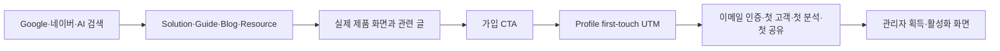

# 인파 검색·AI 유입 성장 설계

> 작성일: 2026-08-03
> 상태: PM 설계 승인 완료, 구현 계획 초안 작성 완료·실행 승인 대기
> 대상: `https://www.inpa.kr` 공개 검색면, 블로그 연결, 공개 실무 자료, 유입·활성화 계측
> PM 결정: 일반 보험 소비자 트래픽이 아니라 보험설계사의 고의도 검색·AI 유입에서 가입과 첫 분석까지를 1차 목표로 한다. 외부 채널은 이번 범위에서 제외하고 자사 사이트, Google Search Console, 네이버 서치어드바이저를 우선한다.

## 1. 목표와 성공 정의

인파를 보험 상식 글이 많은 사이트가 아니라, 위촉직 보험설계사가 고객관리·증권 정리·사실 중심 비교·일정 관리를 찾을 때 발견되는 실무 지식 허브로 만든다.

북극성 지표는 **월간 검색·AI 유입 활성 설계사 수**다.

- 대상 유입: Google, 네이버, ChatGPT, Gemini, Claude, Perplexity와 관련 콘텐츠의 비브랜드 유입
- 활성화 정의: 최초 유입 뒤 7일 안에 가입하고 `첫 분석 + 첫 공유`를 완료
- 보조 지표: 공개 URL 색인 상태, 비브랜드 노출·클릭, 실무 자료 사용, 가입·인증·첫 고객·첫 분석·첫 공유 전환
- 정직성 기준: 검색 순위와 AI 추천은 보장하지 않는다. 동일 조건의 장기 추세와 실제 활성화로 평가한다.

## 2. 현재 상태와 확인된 사실

### 운영 기반

- 운영 `robots.txt`와 `sitemap.xml`은 HTTP 200으로 응답한다.
- 2026-08-03 확인 시 sitemap에는 정적 공개 페이지와 공개 블로그를 합쳐 24개 URL이 있었다.
- 샘플 블로그 상세는 서버 HTML에 고유 title, description, canonical, Organization·BlogPosting JSON-LD, H1, 본문을 포함했다.
- 운영 샘플 응답은 홈페이지 TTFB 약 0.14초, 블로그 목록 약 0.50초, 블로그 상세 약 0.42초였다. 이 수치는 단일 시점 진단값이며 성능 보장을 뜻하지 않는다.
- 검색 결과에서는 인파 홈페이지와 FAQ가 확인됐지만, 신규 블로그 정확 제목과 `보험설계사 고객관리 프로그램` 등 주요 비브랜드 질의에서는 아직 인파가 확인되지 않았다.

### 검색 도구 등록

재등록하지 않는다. 프로젝트 기록상 2026-07-12에 다음 작업이 완료됐다.

- 네이버 서치어드바이저 소유확인
- 네이버 sitemap 제출과 웹페이지 수집 요청
- Google Search Console 도메인 인증
- Google에서 `/faq` 색인 확인

이번 작업에서는 최신 sitemap 수신일, 색인 오류, 제외 사유만 감사한다. 오류가 확인된 경우에만 재제출·수집 요청을 수행한다.

### 기존 자산

- 랜딩, `/story`, `/faq`, `/blog`, canonical, sitemap, robots
- Organization, WebSite, SoftwareApplication, FAQPage, BlogPosting JSON-LD
- 공개 블로그와 관리자 블로그 CRUD
- 첫 유입 UTM 저장, 가입 코호트, 관리자 활성화 퍼널
- 공개 토큰 페이지의 signed token, 만료, rate throttle, noindex 메타

### 확인된 선행 문제

1. 루트의 Vercel Analytics·Speed Insights가 모든 경로에 마운트되어 `/s/<token>`, `/b/<token>`, 고객 번호·작업 UUID 같은 주소 식별자를 수집할 가능성이 있다.
2. Sentry는 `sendDefaultPii=false`지만 오류 이벤트 URL·breadcrumb 안의 토큰과 식별자를 별도로 가리는 로직이 없다.
3. `/home`, `/customers`, `/analysis`, `/sales`, `/login`, `/register`, `/onboarding`의 익명 응답은 HTTP 200이며 noindex가 없다.
4. 현재 robots의 Allow 목록은 색인 허용 목록이 아니다. Disallow에 없는 서비스 경로는 기본적으로 crawl 가능하다.
5. sitemap에는 noindex 레이아웃 아래의 법무 페이지가 포함되어 검색 의도와 sitemap이 일치하지 않는다.
6. sitemap의 블로그 목록을 오래 캐시하면 noindex·비공개 전환 글이 검색봇에 계속 노출될 수 있다. 오류 시 동적 블로그를 빼는 편이 더 안전하다.

선행 문제 1·2는 SEO보다 먼저 고친다. 검색 유입을 늘리기 전에 민감 주소가 계측 시스템으로 전달되는 표면을 닫아야 한다.

## 3. 외부 원칙

- Google AI 검색에는 별도 AI 전용 schema나 파일이 필요하지 않다. 일반 검색 색인 자격, 사람에게 유용한 원본 콘텐츠, 내부 링크, 페이지 경험이 우선이다.
- OAI-SearchBot, Claude-SearchBot, PerplexityBot을 공개 마케팅·콘텐츠 페이지에서 허용하되 고객 토큰·관리자·API는 계속 차단한다.
- `llms.txt`, bot 이름 추가, schema 종류 추가를 핵심 성장책으로 취급하지 않는다.
- sitemap은 발견을 돕지만 색인과 순위를 보장하지 않는다.
- 보험 콘텐츠는 금융·보험 판단에 영향을 줄 수 있으므로 출처, 확인일, 실제 검토자, 상품·회사별 차이를 명확히 한다.

공식 근거:

- Google Search Central, AI features and your website
- Google Search Central, Creating helpful, reliable, people-first content
- Google Search Central, Sitemaps overview and noindex guidance
- OpenAI Publisher FAQ for OAI-SearchBot and ChatGPT referrals
- Naver Search Advisor robots, sitemap, crawl request guides
- Vercel Analytics privacy and `beforeSend` guidance

## 4. 페르소나 카운슬

이번 결정은 사업·콘텐츠, 검색·그로스, 기술·신뢰 세 날개로 나눠 독립 검토한 뒤 공격·방어 토론을 거쳤다.

### 참여 관점

- 사업·콘텐츠: 대표, 기획자, 브랜드 디자이너, 브랜드·PR 마케터, 보험설계사 도메인 전문가
- 검색·그로스: SEO 리드, 퍼포먼스 마케터, 그로스·분석 마케터, 온라인 PR·배포 담당
- 기술·신뢰: UI/UX 전문 개발자, 데이터·백엔드, 보안·인프라, QA·팩트체커, 법무·컴플라이언스

### 독립 의견 요약

- 대표: 넓은 보험 상식보다 `보험설계사 고객관리·보장분석·영업관리 프로그램`처럼 구매·사용 의도가 높은 질의를 먼저 점유한다.
- 기획: 검색 의도 하나당 대표 URL 하나를 두고, 글마다 정보 탐색·실무 작업·제품 검증에 맞는 서로 다른 다음 행동을 제공한다.
- 브랜드: 일반 명사 `인파`와 구분되도록 `인파(Inpa), 위촉직 보험설계사 영업지원 서비스`라는 정체성을 일관되게 사용한다.
- PR·배포: 자사 주장만 늘리지 않고, 고객관리표·체크리스트·방법론 같은 실제 인용 자산을 먼저 만든다.
- 현업·신뢰: 회사·상품·약관별 차이를 일반화하지 않고, 가짜 후기·성과 수치·전문가를 만들지 않는다.
- 기술: 기존 SEO 기반은 양호하지만 색인 정책 불일치와 토큰 URL 계측을 우선 해결한다.

### 토론 요약

1라운드에서는 발행량 중심 안이 빠르지만 검색어 중복, 낮은 신뢰, 제품과 먼 트래픽을 만들 수 있다는 공격이 나왔다. PR 우선 안은 외부 신뢰에 유리하지만 인용할 자체 자료가 약한 상태에서는 일회성 노출에 그칠 수 있다는 반론을 받았다. 기술팀은 두 성장안 모두 민감 URL 계측을 닫기 전에는 확장하면 안 된다고 제동을 걸었다.

2라운드에서는 고의도 대표 페이지, 실무 자료, 실제 합성 데이터 제품 화면, 선택적 검색 등록 감사, 활성화 계측을 하나의 흐름으로 묶는 안에 합의했다. 콘텐츠 위험도는 일반 업무 글, 공식 원문 대조가 필요한 보험 글, 실제 전문가 검토가 필요한 법적 해석 글로 나눴다.

### 비교 점수

| 안 | 핵심 | 의도 적합 | 인용 가능 | 신뢰 | 전환 | 실행성 | 총점 |
|---|---|---:|---:|---:|---:|---:|---:|
| A. 기술 SEO 정리 | 메타·sitemap·검색 도구 감사 | 12 | 8 | 16 | 8 | 14 | 58/100 |
| **B. 제품 증거형 실무 허브** | 안전 기반 + 검색 허브 + 공개 자료 + 활성화 | **20** | **20** | **20** | **18** | **16** | **94/100** |
| C. 외부 PR 우선 | 커뮤니티·제휴·업계 매체 | 12 | 16 | 16 | 12 | 12 | 68/100 |

최종 선택은 B다. 외부 PR은 이번 릴리스에서 제외하고, 인용할 자체 자료와 측정 기반이 생긴 뒤 후속으로 진행한다.

## 5. 릴리스 구조

### Release 1. 안전·색인 기반

목적: 검색 유입 확대 전에 민감 URL 계측과 색인 오염을 막는다.

#### 중앙 검색 정책

프런트에 한 개의 route policy를 둔다.

- `indexable`: 랜딩, story, FAQ, blog, solution, guide, tool, resource, 정식 공개 신뢰 페이지
- `sensitive`: `/s/`, `/b/`, `/c/`, `/d/`, `/p/`, `/r/`, `/recruiting/join/`
- `private_or_utility`: 로그인 이후 서비스, admin, login, register, onboarding, verify/reset 등

같은 정책을 metadata·HTTP header·robots·sitemap·analytics redaction 테스트가 참조한다. 한 파일의 문자열 배열을 기계적으로 모든 런타임에 억지로 공유하기보다, 공통 순수 함수와 공개 manifest를 기준으로 각 Next API가 변환한다.

#### robots와 noindex

- 색인 대상만 sitemap에 포함한다.
- private·utility 응답에 `X-Robots-Tag: noindex, nofollow` 또는 동일한 metadata를 넣는다.
- 민감 토큰 경로는 robots Disallow와 noindex를 유지한다. noindex를 읽기 위해 검색봇 접근을 허용해 고객용 데이터를 가져가게 만들지 않는다.
- signed token, 만료, 권한, rate throttle이 보안 경계다. robots와 noindex는 추가 노출 억제 수단일 뿐이다.
- Search Console에서 private·token URL이 발견되면 원인을 조사하고 필요 시 Removals를 사용한다.
- 법무 페이지가 아직 초안이면 sitemap에서 제외한다. 정식 시행·공개 결정 뒤에만 noindex를 해제하고 sitemap에 다시 넣는다.

#### URL 계측 보호

- Vercel Web Analytics는 indexable 공개 경로만 pageview를 보낸다.
- sensitive와 private 경로는 `beforeSend`에서 `null`을 반환한다.
- Speed Insights는 공개 안전 경로만 수집하거나, 설치된 패키지의 지원 범위를 확인해 식별자 없는 route pattern으로 정규화한다. 지원이 불완전하면 민감·동적 경로 수집을 중단한다.
- Sentry는 오류 종류와 코드 위치를 유지하되 event request URL, transaction, breadcrumb URL에서 query·fragment를 제거하고 토큰·숫자 ID·UUID를 route pattern으로 치환한다.
- redaction 실패 시 원본 전송이 아니라 이벤트 URL 필드를 제거하는 fail-closed 정책을 사용한다.
- 실제 토큰 모양 canary가 빌드·테스트·운영 계측 payload에 남지 않는 회귀 테스트를 둔다.

#### sitemap fail-closed 일관성

- 공개 블로그 sitemap API를 요청마다 조회하고 응답은 저장하지 않는다.
- 조회 실패 시 동적 블로그를 모두 제외하고 정적 공개 URL 5개만 반환한다.
- 가용성보다 noindex·unpublish 전환의 즉시 반영을 우선하며, 과거 성공 목록을 fallback으로 쓰지 않는다.
- `lastmod`는 실제 본문·메타·대표 이미지처럼 검색 결과에 영향을 주는 변경 때만 갱신한다.

### Release 2. 검색 허브

목적: 설계사의 고의도 질의에 대응하는 대표 URL과 내부 연결을 만든다.

#### 솔루션 페이지

| URL | 대표 검색 의도 | 제품 증거 |
|---|---|---|
| `/solutions/customer-management` | 보험설계사 고객관리 프로그램 | 고객 단계, 다음 연락, 일정, 관리자 화면 |
| `/solutions/policy-analysis` | 보험설계사 증권·보장분석 프로그램 | 자동 정리, 담보명 정규화, 보장 한눈표 |
| `/solutions/sales-management` | 보험설계사 영업관리 프로그램 | 고객 유입, DB·TA·FA·청약, 예약, 후속 행동 |

#### 사용자 여정 허브

| URL | 역할 | 연결 콘텐츠 |
|---|---|---|
| `/guides/first-consultation` | 새 고객과 첫 상담 | 증권 요청, 예약 안내, 상담 준비 |
| `/guides/customer-follow-up` | 고객관리와 다음 연락 | 상담 기록, 후속 연락, 고객관리표 |
| `/guides/policy-review` | 증권 정리와 보장 확인 | 증권 보는 순서, 담보명, 보험나이, 직업급수 |
| `/guides/factual-comparison` | 사실 중심 증권 비교 | A/B 비교, 확인 순서, 데이터 처리 |

#### 공통 페이지 구조

1. 검색 질문에 대한 2~4문장 직접 답변
2. 이런 설계사에게 맞는지
3. 현재 업무에서 흩어지는 지점
4. 인파에서 이어지는 실제 순서
5. 합성 데이터 기반 실제 제품 화면
6. 인파가 하는 일과 설계사가 확인할 일
7. 관련 블로그·실무 자료
8. 질문과 답변
9. 최종 확인일과 관련 공식 출처
10. 페이지 의도에 맞는 CTA 한 개

페이지마다 고유 title, description, canonical, H1, OG, BreadcrumbList를 제공한다. 구조화 데이터는 화면에 실제로 보이는 정보와 일치시킨다. 키워드를 반복해 문장을 망가뜨리지 않는다.

#### 콘텐츠 소유 방식

- 첫 3개 solution과 4개 guide는 프런트의 단일 typed content source와 공통 템플릿으로 구현한다.
- 현재 7개 고정 페이지 때문에 두 번째 CMS와 DB schema를 만들지 않는다.
- 글 운영은 기존 BlogPost와 `/admin/blog`을 계속 사용한다.
- 검색 허브가 10개를 넘거나 월 2회 이상 비개발 수정이 반복되면 관리자 편집 기능을 별도 설계한다.
- 모든 공개 문구는 copy lint, 출처 검토, 실제 화면 검증을 거친다.

### Release 3. 공개 자료와 활성화 측정

목적: AI와 검색엔진이 직접 인용할 수 있고 설계사가 다시 찾는 원본 자료를 만든다.

#### 공개 자료

| URL | 결과물 | 개인정보 원칙 |
|---|---|---|
| `/tools/insurance-age` | 보험나이 계산과 경계일 설명 | 브라우저 안에서만 계산, 서버 전송·저장 없음 |
| `/resources/customer-management-sheet` | 고객관리표 필수 칸, 복사·다운로드 자료 | 이름·전화·병력 없는 빈 템플릿 |
| `/resources/consultation-checklist` | 상담 전·후 확인 체크리스트 | 사용자 입력 수집 없음 |

보험나이 계산은 구현 전에 최신 공식 근거와 경계일을 재검증한다. 회사·상품별 최종 기준이 다를 수 있음을 다음 확인 행동으로 설명한다. 직업급수 원본 전체 공개와 담보 정규화 사전 공개는 데이터 권리와 핵심 IP 문제 때문에 이번 범위에서 제외한다.

#### 계측

이벤트는 allowlist된 enum과 식별자만 사용한다.

- `search_landing_view`: page_key, cluster, referrer_class, allowlisted UTM
- `search_landing_cta_click`: page_key, cta_type, destination enum
- `public_resource_use`: resource_key, action enum
- 가입 후 기존 Profile UTM과 activation funnel을 연결
- 관리자 획득 화면: search·ai·direct·other별 가입, 인증, 첫 고객, 첫 분석, 첫 공유, 7일 활성화

저장하지 않는 값:

- 검색어 원문
- AI 질문·답변 원문
- 전체 referrer URL
- 고객 이름·전화·생년월일·증권 내용
- 공개 토큰·UUID·내부 숫자 ID

Google Search Console과 네이버의 노출·클릭·색인 지표는 각 공식 콘솔에서 본다. 이번 릴리스는 외부 콘솔 API 연동과 credential 저장을 만들지 않는다.

#### AI 가시성 점검

- 30개 고정 한국어 질문을 정한다.
- ChatGPT, Gemini, Claude, Perplexity에서 월 1회 같은 조건으로 수동 점검한다.
- 브랜드 언급, 직접 URL 인용, 사실 정확성, 추천 문맥을 기록한다.
- 한 번의 답변 노출을 성과로 발표하지 않고 월별 추세만 본다.

## 6. 데이터 흐름

- 공개 페이지는 SSR 또는 검색 친화적인 정적·재검증 방식으로 핵심 텍스트를 초기 HTML에 제공한다.
- 공개 허브는 백엔드 장애와 무관하게 열린다.
- 블로그 연결은 기존 공개 API의 최신 응답만 사용하고, 조회 실패 시 관련 글만 제외해 허브 본문을 유지한다.
- CTA는 기존 UTM first-touch를 보존한다.
- 분석 실패가 가입·페이지 이동 같은 주 동작을 막지 않는다.

## 7. 오류·빈 상태·성능

- 검색 허브의 필수 콘텐츠는 코드에 있으므로 API 오류로 빈 화면이 되지 않는다.
- 블로그 목록 연결 실패 시 허브 본문은 유지하고 관련 글 영역만 다시 시도 가능한 안내를 보여준다.
- 비공개·삭제 slug는 200 빈 화면이 아니라 404를 반환한다.
- 공개 자료는 입력값 오류를 쉬운 말과 다음 행동으로 안내한다.
- 모바일에서 표는 가로 잘림 대신 카드 또는 안전한 스크롤을 사용한다.
- 공개 이미지에는 실제 고객정보·보험사 로고·상품명·QR·알림·EXIF가 없어야 한다.
- LCP, INP, CLS는 Vercel의 안전하게 정규화된 공개 경로 데이터로 확인한다.

## 8. 콘텐츠·브랜드·신뢰 기준

- 대표 표현: `인파(Inpa), 위촉직 보험설계사를 위한 AI 영업 파트너`
- 영문: Insurance Partner
- 한글 합성어: 인슈어 파트너
- 답 먼저, 실제 결과물, 공식 출처, 확인일, 관련 기능 순서를 기본으로 한다.
- `1위`, `검증 완료`, `안전`, 가짜 후기·전문가·성과 수치를 쓰지 않는다.
- 특정 상품·보험사 우열, 적정 보장액, 갈아타기 판단을 제공하지 않는다.
- 담보명이 비슷한 것과 지급 조건이 같은 것을 구분한다.
- 정액형과 실손형의 중복 의미를 구분한다.
- 실제 전문가 검토가 완료된 글만 이름·자격·검토일을 표시한다.
- 조직 저자 `인파 담당자`는 허용하되 사람 전문가처럼 표현하지 않는다.
- 생성형 이미지는 장식에만 쓰고 제품 근거는 실제 합성 데이터 화면과 직접 만든 도식으로 보여준다.

## 9. 30·60·90일 운영

### 30일

- 민감 URL analytics·Sentry canary 유출 0건
- 공개·비공개 route policy 회귀 테스트 통과
- sitemap·canonical·noindex 모순 0건
- Google·네이버의 기존 등록과 최신 sitemap 처리 상태 확인
- 목표 URL별 색인 상태와 첫 14일 노출·클릭 기준선 기록

### 60일

- solution 3개, guide 4개 공개 URL의 수집·색인 상태 확인
- 비브랜드 노출·클릭과 페이지별 CTA·가입 흐름 확인
- 노출은 있으나 클릭이 낮은 제목·직접 답변 개선
- 제품과 먼 유입과 활성화로 이어지는 유입 분리

### 90일

- 공개 자료 3개의 검색 유입·사용·가입 보조 기여 확인
- 검색·AI 유입 설계사의 7일 활성화율 평가
- 30개 고정 질문의 브랜드 언급·직접 인용·정확성 추세 확인
- 인용·활성화가 확인된 자료를 다음 콘텐츠 우선순위로 선정

목표값은 첫 14일 기준선 뒤 확정한다. 근거 없이 트래픽·순위·AI 언급 수를 약속하지 않는다.

## 10. 검증

### 자동 검증

- route policy matrix: indexable·sensitive·private 분류 누락 0건
- robots·sitemap·metadata·X-Robots가 route policy와 일치
- sitemap에 noindex·unpublished·token·private URL 0건
- token·UUID·숫자 ID canary가 Analytics·Speed Insights·Sentry payload에 남지 않음
- solution·guide·resource마다 고유 title, description, canonical, H1
- 구조화 데이터와 화면 문구 일치
- UTM 보존과 event allowlist 테스트
- 보험나이 경계일 golden cases
- copy lint, TypeScript·Next build, 관련 프런트 테스트, gitleaks

### 런타임·화면 검증

- 데스크톱·모바일에서 10개 신규 URL 실제 렌더 확인
- 로딩·오류·404·빈 상태 확인
- 실제 CTA가 올바른 공개·가입 경로로 이동
- 운영 HTML에 핵심 답변과 내부 링크가 서버 렌더됨
- 실제 `robots.txt`, `sitemap.xml`, canonical, X-Robots 응답 확인
- Vercel·Sentry 수집 화면에서 민감 경로·토큰이 새로 들어오지 않는지 확인

### 검색 운영 검증

- Google Search Console sitemap 최신 성공 시각과 Page Indexing 확인
- 네이버 서치어드바이저 sitemap·수집·색인 리포트 확인
- 이미 정상인 등록은 재등록·반복 제출하지 않음
- `site:` 검색은 참고만 하고 URL Inspection·공식 콘솔을 권위로 사용

## 11. 배포·롤백

- PM은 2026-08-03에 설계, 구현, 운영 배포를 명시적으로 승인했다.
- Release 1, 2, 3은 각각 별도 검증·PR·배포 단위로 둔다.
- 기존 공유 작업 트리의 미커밋 블로그·랜딩·마케팅 파일은 덮어쓰거나 함께 stage하지 않는다.
- 각 Release는 preview에서 자동 테스트와 브라우저 검수 뒤 운영 배포한다.
- 구현 계획 검토 결과 Release 3 관리자 획득 화면은 기존 `Profile.utm_*`와 활성화 timestamp만으로 구현해 DB migration을 만들지 않는다.
- 롤백은 직전 Vercel·Render 배포, 신규 페이지 route 제거, 획득 채널 UI·집계 commit revert 순서로 수행한다.
- 운영 반영 뒤 실제 URL, Render health, Sentry, Vercel Analytics, Google·네이버 상태를 확인한다.
- 기능이 구현·병합·배포된 Release마다 README.md와 AGENTS.md를 해당 릴리스 사실만 반영해 갱신한다.

## 12. 범위 제외

- 네이버 블로그·인스타그램·Threads·YouTube·언론 PR 운영
- 유료 백링크, 검색 광고, 커뮤니티 위장 홍보
- 외부 SEO·GEO 점수 도구 구독
- Search Console·네이버 API credential 저장과 자동 동기화
- 직업급수 원본 전체 공개
- 담보 정규화 사전 원본 공개
- 검색 순위·AI 추천 보장
- 자동 대량 콘텐츠 생성
- solution·guide 전용 CMS

## 13. 최종 산출물

- 안전한 공개 route·검색 정책
- 민감 URL이 제거된 Analytics·Speed Insights·Sentry
- 검색 의도별 solution 3개와 guide 4개
- 보험나이 계산기, 고객관리표, 상담 체크리스트
- 블로그·FAQ·랜딩의 내부 연결
- 검색·AI 유입에서 7일 활성화까지 보는 관리자 지표
- Google·네이버 기존 등록 감사 결과
- 30개 AI 질문 점검표
- 자동·브라우저·운영 검증 결과와 롤백 기록
